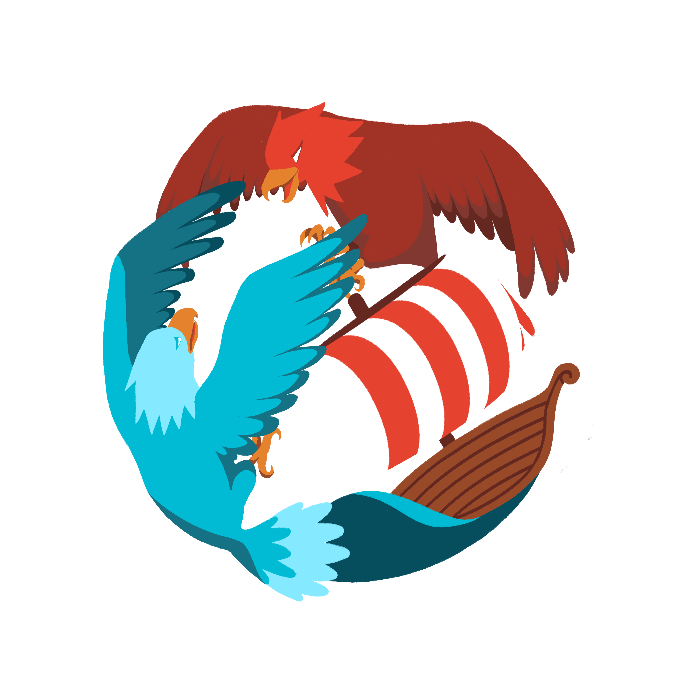

# Prologin 2024 - Des Iles et des Aigles

This is the final game (2024 edition) of the French national computing contest
[Prologin](https://prologin.org/). Candidates are asked to create an AI in 36
hours for this specific game. The final ranking will be determined at the end
with a tournament where each AIs compete against each other.

The pdf subject can be found [here](docs/sujet.pdf).

## How to use it?

prologin2024 is meant to be used with
[stechec2](https://github.com/prologin/stechec2/), our custom made AI match
maker.

## Documentation

The documentation is located in [docs/](docs/).

## License

Free use of this software is granted under the terms of the GNU General Public
License version 3+ (GPLv3+). For details see the [LICENSE](LICENSE) file.
